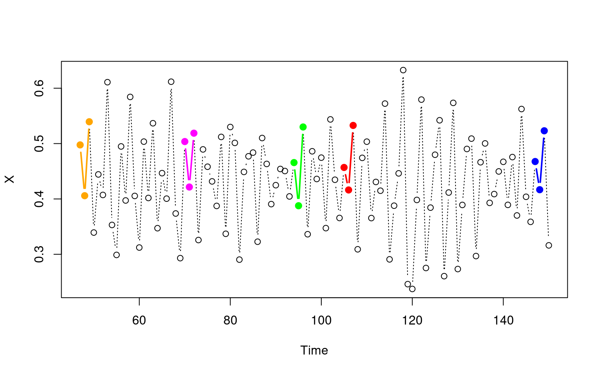
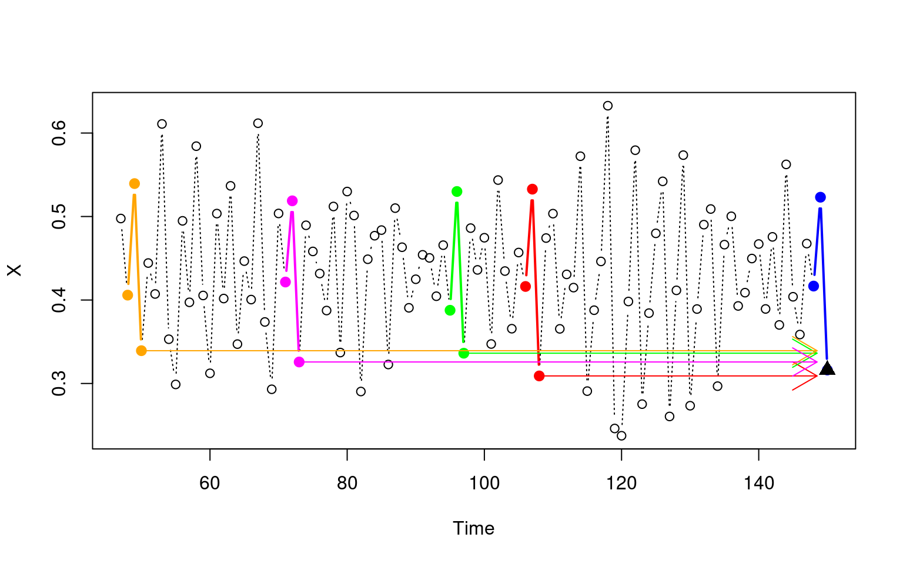

# EDM Algorithms 

## Simplex : Nearest Neighbor Projection

The `Simplex` algorithm is a nearest neighbor projection. It collects the `knn` 
nearest points to the query point in phase space, then calculates the prediction 
as the normalized weighted trajectory of each neighbor, each neighbor contributing 
to the prediction proportional to their distance to the query point.
It is a simple prediction algorithm typically used to quickly estimate how much
information the attractor has for predicting a variable.  
The images below illustrate the algorithm:

Note: the plots for the Simplex reconstruction were taken from the 
[mathbio tutorial](https://mathbio.github.io/edmTutorials/) on the EDM algorithms.

## S-Map : Sequential Locally Weighted Global Linear Maps
See the link to the exported jupyter notebook below on the S-Map algorithm:  
Jupyter notebook: [S-MAP Notebook ](https://github.com/cameronosmith/EDM_notebooks/blob/master/SMAP.ipynb)   

tldr: For every query point, S-MAP constructs a linear function from all 
state-space neighbors. However, each neighbor is weighted with an exponential 
function based on theta, such that nearby points to the query point 
have a higher weight than those further from it. Hopefully it makes sense now 
why SMAP stands for sequentially weighted global linear maps, since the algorithm: 
for every query point (sequentially) weights the entire library (weighted global) 
and then computes a linear solution mapping the local space on the reconstructed 
attractor to the space of the target variable (linear maps).

## CCM : Convergent Cross Mapping

<iframe width="100%" height="335" src="https://www.youtube.com/embed/NrFdIz-D2yM" 
frameborder="0" allow="autoplay; gyroscope; picture-in-picture" allowfullscreen></iframe>  
  
**Algorithm pseudocode taken from the **[Wikpedia page on CCM](https://en.wikipedia.org/wiki/Convergent_cross_mapping#cite_note-8):  
1. Create the shadow manifold for X, called MX.  
2. Find the nearest neighbors to a point in the shadow manifold at time t.  
3. Create weights using the nearest neighbors.  
4. Estimate Y using the weights; (this estimate is called  Y |  MX ).  
5. Compute the correlation between Y and Y | MX.
  
Briefly, the intuition behind Convergent Cross Mapping:  
Takens' Theorem states that it is possible to reconstruct an attractor of a
dynamical system by lagged observations of an observer of the system. 
If variable X had some influence on variable Y (X causes Y), 
there should exist some "imprint" or "artifact" of X in Y's reconstructed 
attractor that should allow us to predict X from Y's reconstructed
attractor. Note that the reverse direction is not necessarily true. 
