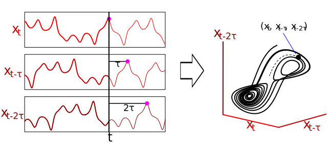

# EDM Algorithms In-Depth

## Embed : Attractor Reconstruction

The primary goals of the EDM algorithms are to predict and analyze complex, 
nonlinear systems. Using real world data, rarely do we have every variable
of the system studied, as systems in the real world are high-dimensional.  
To compensate for this unavoidable handicap of lacking the whole system, we use
attractor reconstructions to recover the missing variables in the system. 
Takens' Theorem proves that this reconstruction is possible - that information 
of the missing variables/rules of the system are encoded/impressed onto the 
variables we do have. Another relevant part of Takens' Theorem is that states in
our reconstructed system map to the actual system states - which is important 
considering we're analyzing nonlinear systems!  
The Embed function creates the embedding's lags. Use it
to create *E* lags of variable X for us, where a point at *t* in the embedding 
is defined as ***( x_t, x_(t-τ), ..., x_(t-(E-1)τ) )***.  

Consider the graphs above: Notice that three subplots are the same variable *X*,
just lagged. Now look at the phase space plot of our three variables : the 
attractor reconstruction looks just the true lorenz system; the two states 
(each lobe) were preserved. 

## Simplex : Nearest Neighbor Projection

The Simplex algorithm is a nearest neighbor projection. It searches for the 
nearest points to our query point in phase space, 
irrespective of the time point of the system. It then takes the collected neighbors,
moves them each one time step forward from the time point they were collected at, 
weights that next point by how close the neighbor was to our query point, 
and sums up the weighted predictions from each neighbor to get our prediction.
Basically, what we're doing is searching for the embedded points that were most
similar to ours, seeing where they each went at their next time step, and 
letting their value at their next time step influence our decision by a factor
of how similar they were to our query point.  
An illustration of what Simplex is performing: Consider this discrete system 
simulation, and our query point in blue. Using an embedding of two, we have
identified our four nearest neighbors (other colored points). The third point
on our colored nearest neighbors is their value at their next time step.  
.
Now we use each of our neighbors next value (third point) to predict our next point.
The weighting process is not illustrated here, but note that Simplex would 
weight each of these neighbors' next point by how similar they were to our query
point.   
.

## SMap : Sequential Locally Weighted Global Linear Maps
SMap 
## CCM : Convergent Cross Mapping
CCM 

