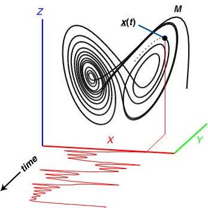

# Empirical Dynamic Modeling (EDM) Documentation

------

# EDM

EDM is a toolkit for analyzing time series of nonlinear dynamical systems,
with primary applications of forecasting and causal inference.  
  
An overview of the algorithms provided is provided below and a more in-depth 
tutorial will be provided further in the documentation.   
  
The EDM algorithms are available in Python and R, in the packages pyEDM and rEDM, 
respectively.

------

# Foundations of EDM
   
##Time Series as Observations of a Dynamic System

<iframe width="100%" height="335" src="https://www.youtube.com/embed/QQwtrWBwxQg" 
frameborder="0" allow="autoplay; gyroscope; picture-in-picture" allowfullscreen></iframe>

Once the state space is reconstructed via lagged embedding, system prediction is performed 
via locally weighted linear models, and causal analysis is performed by attempting 
to recover a causal variable from the dependent variable's state space reconstruction. 
See the [algorithms in depth section](./algorithms_in_depth) for details on these 
functions, respectively, Sequentially Locally Weighted Global Linear Maps (S-MAP) 
and Convergent Cross Mapping (CCM).

------

# Why EDM is Necessary for Today's Data

Many fields use models as approximations of real world systems (e.g. testing 
hypotheses to explain mechanisms or processes or predicting future outcomes).   

However, real world systems are most often nonlinear and 
high dimensional, making explicit parametric equations impractical. Empirical
models, which infer patterns and associations from the data (instead of using 
discrete, hypothesized equations), represent a more natural and flexible 
approach to modeling the real world.  

Empirical Dynamic Modeling (EDM) provides a framework for predicting and
analyzing nonlinear dynamical systems which are typically problematic for 
traditional modeling approaches. 

------
